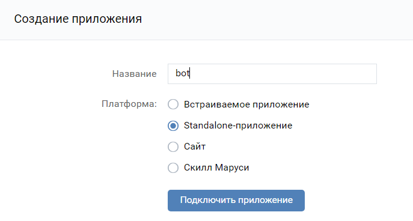
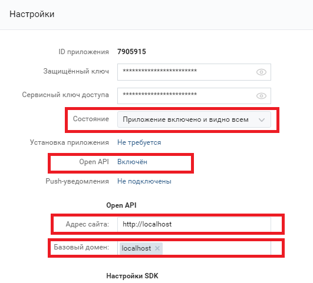

# Как получить ключ доступа пользователя

## Для этого нужно:
1. Создать Standalone-приложение в VK https://vk.com/editapp?act=create
   
2. Затем открыть Настройки и сделать всё как на скриншоте

3. Для создания ключа доступа пользователя нужен параметр "ID Приложения"
4. В браузере в адресную строку введите  
https://oauth.vk.com/authorize?client_id=IDПриложения&display=page&scope=offline&response_type=token&v=5.131&state=123456
   Для параметра client_id укажите ID Приложения
    
5. После перехода по ссылке браузер вернет в адресной строке ключ доступа пользователя,
   параметр access_token
    
